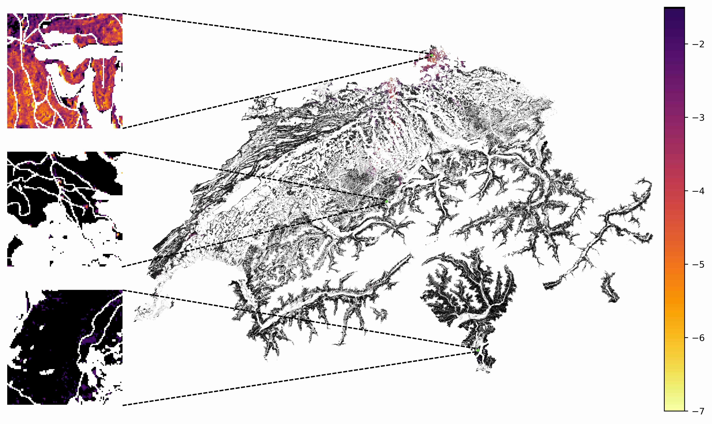

# Sentinel-2 Forest Browning Monitoring

Code for **Country-wide, high-resolution monitoring of forest browning with Sentinel-2** (ISPRS Congress 2026)

👥 **Authors:** Samantha Biegel, David Brüggemann, Francesco Grossi, Michele Volpi, Konrad Schindler, Benjamin Stocker<br>
🌐 **Website:** [samanthabiegel.github.io/forestbrowning](https://samanthabiegel.github.io/forestbrowning/)<br>
📄 **Paper:** [arXiv 2604.02074](https://arxiv.org/abs/2604.02074)



This project generates Switzerland-wide, 10 m resolution NDVI anomaly maps from Sentinel-2 imagery to monitor forest browning events (drought stress, beetle outbreaks, storm damage, fire, and clear-cuts). A neural network learns the expected seasonal vegetation cycle per pixel; deviations from this expectation are flagged as anomalies.

---

## Repository contents

```text
s2-forest-browning-monitoring/
├── src/forest_browning/
│   ├── config.py              # path constants (configured via env var)
│   ├── dataset.py             # dataset utilities
│   ├── mlp.py                 # autoencoder architecture
│   ├── train.py               # model training
│   ├── inference.py           # anomaly score generation
│   ├── shuffle_train_data.py  # pre-shuffle training data
│   ├── rechunk_output.py      # reformat output for spatial access
│   └── data_processing/       # 12-step dataset creation pipeline
├── notebooks/
│   └── plot_results.ipynb     # reproduces all figures → figs/
├── data/
│   └── event_polygons/        # labelled disturbance event polygons
├── checkpoints/
│   └── encoder.pt             # pre-trained model checkpoint
├── tests/
├── pyproject.toml
├── uv.lock
└── README.md
```

---

## Requirements

- Python 3.12 or later
- [uv](https://docs.astral.sh/uv/)
- GDAL CLI tools (`gdalwarp`, `gdaldem`, `gdal_calc.py`)
- TauDEM (`d8flowdir`, `aread8`) with MPI

---

## Installation

### GDAL

**Ubuntu/Debian:**
```bash
sudo apt install gdal-bin
```

**macOS:**
```bash
brew install gdal
```

**Verify:**
```bash
gdalwarp --version
```

### TauDEM

Step 6 of the data pipeline uses [TauDEM](https://hydrology.usu.edu/taudem/taudem5/) for hydrological feature computation. TauDEM is a compiled binary and requires an MPI implementation.

**Ubuntu/Debian:**
```bash
sudo apt install libgdal-dev libopenmpi-dev cmake git
git clone https://github.com/dtarb/TauDEM.git
cmake -S TauDEM/src -B TauDEM/build && cmake --build TauDEM/build -j4
sudo cmake --install TauDEM/build
```

**macOS:**
```bash
brew install open-mpi cmake
git clone https://github.com/dtarb/TauDEM.git
cmake -S TauDEM/src -B TauDEM/build && cmake --build TauDEM/build -j4
sudo cmake --install TauDEM/build
```

**Verify:**
```bash
which d8flowdir && mpiexec --version
```

### Python environment

```sh
git clone git@github.com:SamanthaBiegel/s2-forest-browning-monitoring.git
cd s2-forest-browning-monitoring
uv sync --group dev
source .venv/bin/activate
```

Install the pre-commit hooks:

```sh
pre-commit install
```

---

## Configuration

Before running any pipeline step, set the environment variable `FOREST_BROWNING_DATA_DIR`
to point to your local data storage:

```sh
export FOREST_BROWNING_DATA_DIR=/your/local/data/dir
```

Note: two external datasets must be downloaded manually and placed in `FOREST_BROWNING_DATA_DIR`:

- **Tree species map:** request access via https://www.envidat.ch/#/metadata/tree-species-map-of-switzerland and place the obtained `.tif` raster in `FOREST_BROWNING_DATA_DIR`.
- **Habitat map:** download from https://www.envidat.ch/#/metadata/the-habitat-map-of-switzerland-v1-1 and place `habitatmap_v1_1_20241025.tif` in `FOREST_BROWNING_DATA_DIR`.

---

## Dataset creation

The dataset building pipeline consists of 12 steps orchestrated by a runner module. The individual step scripts are in `src/forest_browning/data_processing/` with digit prefixes (e.g., `1_extract_swisstopo_dataset.py`); the runner invokes them sequentially and exits if any step fails.

**Activate the virtual environment first:**

```sh
source .venv/bin/activate
```

### Option 1: Use the Python module

```sh
python -m forest_browning.data_processing.pipeline
```

### Option 2: Run a single step manually

To run one step in isolation:

```sh
python src/forest_browning/data_processing/1_extract_swisstopo_dataset.py
```

### Output dataset

The pipeline produces two Zarr datasets:

| File | Chunking | Use case |
|------|----------|----------|
| `ndvi_dataset_temporal.zarr` | `(num_forest_pixels, num_timesteps)` | Training and inference |
| `ndvi_dataset_spatial.zarr` | `(num_timesteps, num_forest_pixels)` | Fast per-day map retrieval |

A forest mask (`forest_mask.npy`) maps between the 1-D pixel index used in the datasets and the original 2-D spatial grid.

---

## Training and inference

Activate the virtual environment first:

```sh
source .venv/bin/activate
```

**Step 1 – Pre-shuffle the training dataset:**

```sh
python -m forest_browning.shuffle_train_data \
    --input_zarr /path/to/ndvi_dataset_temporal.zarr \
    --output_zarr /path/to/ndvi_dataset_filtered_shuffled.zarr
```

**Step 2 – Train the neural network:**

```sh
python -m forest_browning.train \
    --data_path /path/to/ndvi_dataset_filtered_shuffled.zarr \
    --output_dir /path/to/work/dir
```

**Step 3 – Run inference to generate anomaly scores:**

This step will add the anomaly scores as an additional layer to the supplied zarr file. Adapt `--encoder_path` path if you want to run a model trained in step 2.

```sh
python -m forest_browning.inference \
    --encoder_path checkpoints/encoder.pt \
    --data_path /path/to/ndvi_dataset_temporal.zarr \
    --output_path /path/to/ndvi_dataset_temporal.zarr
```

**Step 4 – Rechunk output for spatial access:**

```sh
python -m forest_browning.rechunk_output \
    --source_zarr /path/to/ndvi_dataset_temporal.zarr \
    --target_zarr /path/to/ndvi_dataset_spatial.zarr
```

---

## Reproducing figures

Open and run `notebooks/plot_results.ipynb`. Figures are saved to `figs/`.

---

## Citation

If you use this code or data in your research, please cite:

```bibtex
@proceedings{biegel2025forestbrowning,
  title   = {Country-wide, high-resolution monitoring of forest browning with {Sentinel-2}},
  author  = {Biegel, Samantha and Br{\"u}ggemann, David and Grossi, Francesco and Volpi, Michele and Schindler, Konrad and Stocker, Benjamin},
  booktitle = {ISPRS Annals of the Photogrammetry, Remote Sensing and Spatial Information Sciences},
  year    = {2026},
}
```

---

## License

This project is licensed under the terms of the [LICENSE](LICENSE) file.
